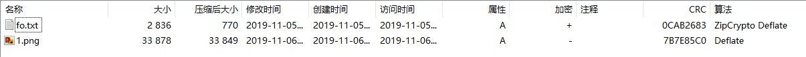
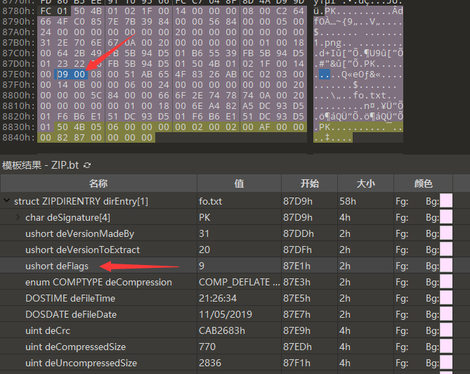
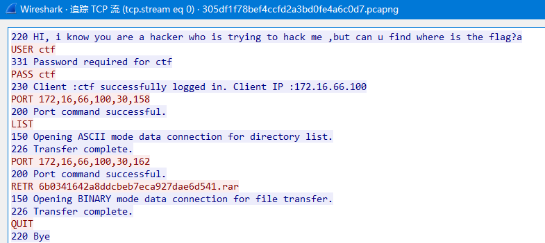
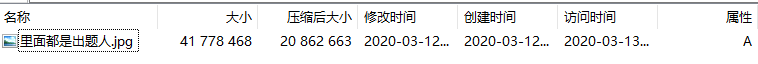
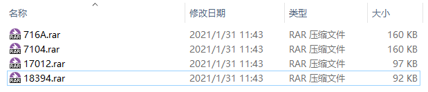
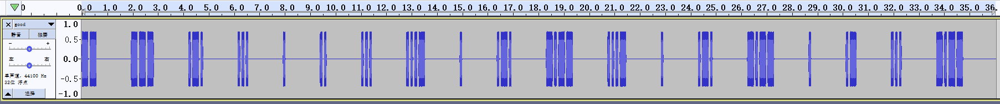
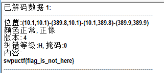
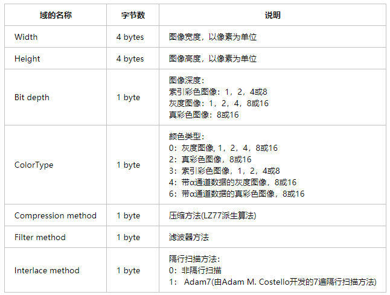

##  Week 4, 01/24 - 01/30 BUUCTF

### 被偷走的文件

打开流量包, 发现一些FTP协议的包, 用`ftp or ftp-data`筛选出来, 结果如下.


55 号包就是服务器返回的包含 flag.rar 的数据包, 右键详情中的 FTP Data 分组, 导出分组字节流. 从文件头的`Rar!`可以判定, 这是一个 rar 文件.

打开导出的文件, 发现需要密码, 用 ARCHPR 爆破, 得到四位密码`5790`, 进而得到 flag.

`flag{6fe99a5d03fb01f833ec3caa80358fa3}`

#### 另一种提取数据的做法

从 [pcapng 的规范](https://pcapng.github.io/pcapng/draft-tuexen-opsawg-pcapng.html)中, 我们可以发现数据包在捕获文件中是明文存储的, 同时 FTP 的数据也是明文传输的, 所以我们可以直接使用 binwalk 或者 foremost 从 pcapng 中提取文件.

如果提取出的文件太多的话, 也可以先导出指定的数据包再尝试提取.


### [BJDCTF2020] 认真你就输了

打开, 是一个 xls 文件, 但不能正常显示.

不过 xls 文件本身也是一个 zip 压缩包, 直接解压, 在 xl/charts 下面发现一个 flag.txt, 打开就是 flag...

`flag{M9eVfi2Pcs#}`


### [BJDCTF2020]藏藏藏

打开, 是张 jpg 图片, 用 stegsolve 看一下 File Format...


看来文件末尾藏了点东西, 熟悉的 `50 4B 03 04` - 应该是个 zip . 比较奇怪的是, 用 binwalk 没能识别到 zip 头, 只识别到了结尾...


不过关系不大, 用 UltraEdit (或者别的什么十六进制编辑器)打开, 定位到 zip 文件头, 在`0xC7EE`的位置, 写个 python 脚本从这里切分就行.

打开切分得到的 zip 文件, 里面是个 docx 文件, 打开扫码, 得到flag.

`flag{you are the best!}`


### [GXYCTF2019] 佛系青年

打开压缩包, 里面有一张图, 一个 txt, 后者是加密的.



到这里, 会产生两种想法: 

- 压缩包的密码在图里, 得先把密码找到 (错了)
- **压缩包是伪加密的** (这才是对的...)

#### 错误示范

用 stegsolve 尝试无果, 尝试用 zsteg 检测隐写方式, 发现不支持 - 文件头是 `FF D8 FF D9`...原来是个 jpg  ~~又被出题人套路了,下次一定注意先用file确认一下~~

用 stegdetect 检测, 系数为 10.0, 报告可能是 jphide, 用 stegbreak 跑字典, 未果.

至此发现, 此路不通...😭

#### 正解

因为存在未加密的文件, 因此一定不是全局伪加密, 可能是单独设置了每一个文件记录的加密位.

用 010 Editor 打开, 定位到 dirEntry[1], 也就是 fo.txt 对应的记录的位置, 发现 [`deFlags`](https://www.jianshu.com/p/8e4209bca4af)是`09 00`, 存在伪加密, 修改为`00 00`, 正常解压出了 fo.txt.



在最下面我们发现了这么一串东西.

> 佛曰：遮等諳勝能礙皤藐哆娑梵迦侄羅哆迦梵者梵楞蘇涅侄室實真缽朋能。奢怛俱道怯都諳怖梵尼怯一罰心缽謹缽薩苦奢夢怯帝梵遠朋陀諳陀穆諳所呐知涅侄以薩怯想夷奢醯數羅怯諸

在[这里](http://www.keyfc.net/bbs/tools/tudoucode.aspx)解密, 得到 flag.

`flag{w0_fo_ci_Be1}`

~~所以那张图真的没有用啊....~~

### 秘密文件

打开流量包, 发现大量 FTP 协议流量, 跟踪.



发现一个 rar 文件, binwalk 分离, 发现有密码, 爆破, 得口令为`1903`, 解压得 flag.

`flag{d72e5a671aa50fa5f400e5d10eedeaa5}`

~~我一开始还以为密码是ctf来着...~~


### [BJDCTF2020] 你猜我是个啥

下载附件, 打开, 提示不是个有效的压缩文件...

010 Editor, 发现是个 png, 打开发现是一个二维码, 在文件尾有明文 flag.

`flag{i_am_fl@g}`


### [BJDCTF 2nd] EasyBaBa

下载, 得到一个 19.9 MB 的 454x427 的 jpg 文件...这大小显然不对啊...

binwalk 分离, 发现 zip 结尾, 从 `0x6E43`手动分离 zip, 得到了这个



查看文件头, 发现是一个 avi 视频, 打开, 在里面发现几个隐藏的一闪而过的二维码, 截图, 用 QR Research 解码, 拼接得flag.

`flag{imagin_love_Y1ng}`


## Week 5, 01/31 - 02/06, BUUCTF

### [SWPU2019] 神奇的二维码

下载附件, 打开, 用 binwalk 分离一下, 得到四个 rar 压缩包.



先看第一个`7104.rar`, 里面有一个 `encode.txt`, 打开是一段 base64: `YXNkZmdoamtsMTIzNDU2Nzg5MA==`, 解码得`asdfghjkl1234567890`.

对于`716A.rar`, 有一张图片和压缩包, 内层压缩包需要密码 - 也就是我们刚刚拿到的解码后的内容...不过解压之后检查, 并没发现 flag...

~~看看flag在不在里面?~~

~~不在😡~~

在`17012.rar`中, 我们发现了一个 flag.doc, 里面有一段很长的, 看上去是 base64 的东西, 解码一下, 变成了另一段 base64... ~~有点意思~~

重复解码多次之后, 我们得到了`comEON_YOuAreSOSoS0great`, 用这个解压 `18394.rar`, 有一段音频.

放到 Audacity 里看一下, 明显是[摩尔斯电码](https://zh.wikipedia.org/wiki/摩尔斯电码), 用[这个](https://morsecode.world/international/decoder/audio-decoder-adaptive.html)解码一下(或者自己来也行), 得到 flag.



flag: `flag{morseisveryveryeasy}`


BTW, 直接扫描二维码会告诉你 `flag is not here`...



### [BJDCTF2020] 一叶障目

下载打开, 发现 Honeyview 打不开图片, 但是资源管理器能显示预览图 - 显然图的某些东西是被改过了.

用 010 Editor 打开, 报了 CRC 校验错误, 结合之前看到的条状图案, 怀疑是宽高被改了.

对于 [PNG 图片](https://dev.gameres.com/Program/Visual/Other/PNGFormat.htm), 宽高这些信息保存在 IHDR 中, 作为第一个数据块紧接着文件头之后. IHDR 长 13 字节, 定义如下.



所以在已知 CRC 的前提下, 我们可以通过在合理范围内穷举宽高的方式得到正确的大小.

```python
#coding=utf-8
import zlib
import struct
import time

time_start=time.time()

#读文件
file = '1.png'  #注意，1.png图片要和脚本在同一个文件夹下哦~
fileRead = open(file,'rb').read()
data = bytearray(fileRead[12:29]) #0xCh ~ 0x1Ch
crc32key = eval(str(fileRead[29:33]).replace('\\x','').replace("b'",'0x').replace("'",''))

#crc32key = 0xCBD6DF8A #补上0x，copy hex value
#data = bytearray(b'\x49\x48\x44\x52\x00\x00\x01\xF4\x00\x00\x01\xF1\x08\x06\x00\x00\x00')  #hex下copy grep hex
n = 4095 #理论上0xffffffff,但考虑到屏幕实际，0x0fff就差不多了

for w in range(n):#高和宽一起爆破
    width = bytearray(struct.pack('>i', w))#q为8字节，i为4字节，h为2字节
    for h in range(n):
        height = bytearray(struct.pack('>i', h))
        for x in range(4):
            data[x+4] = width[x]
            data[x+8] = height[x]
            #print(data)
        crc32result = zlib.crc32(data)
        if crc32result == crc32key:
            #print("Correct Width: " + (width) + "\nCorrect Height: " + (height))
            #写文件
            newpic = bytearray(fileRead)
            for x in range(4):
                newpic[x+16] = width[x]
                newpic[x+20] = height[x]
            fw = open(file+'_CRC_Repaired.png','wb')#保存副本
            fw.write(newpic)
            fw.close

time_end=time.time()
print("CRC Repaired, saved as " + file+'_CRC_Repaired.png')
print('Time Used: ',str(time_end-time_start),'s')

```

查看修复后的图片, 得到 flag.

`flag{66666}`

