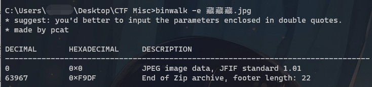

##  Week 4, 01/24 - 01/30 BUUCTF

### 被偷走的文件

打开流量包, 发现一些FTP协议的包, 用`ftp or ftp-data`筛选出来, 结果如下.

55 号包就是服务器返回的包含 flag.rar 的数据包, 右键详情中的 FTP Data 分组, 导出分组字节流. 从文件头的`Rar!`可以判定, 这是一个 rar 文件.

打开导出的文件, 发现需要密码, 用 ARCHPR 爆破, 得到四位密码`5790`, 进而得到 flag.

`flag{6fe99a5d03fb01f833ec3caa80358fa3}`

#### 另一种提取数据的做法

从 [pcapng 的规范](https://pcapng.github.io/pcapng/draft-tuexen-opsawg-pcapng.html)中, 我们可以发现数据包在捕获文件中是明文存储的, 同时 FTP 的数据也是明文传输的, 所以我们可以直接使用 binwalk 或者 foremost 从 pcapng 中提取文件.

如果提取出的文件太多的话, 也可以先导出指定的数据包再尝试提取.

### [BJDCTF2020] 认真你就输了

打开, 是一个 xls 文件, 但不能正常显示.

不过 xls 文件本身也是一个 zip 压缩包, 直接解压, 在 xl/charts 下面发现一个 flag.txt, 打开就是 flag...

`flag{M9eVfi2Pcs#}`

### [BJDCTF2020]藏藏藏

打开, 是张 jpg 图片, 用 stegsolve 看一下 File Format...

看来文件末尾藏了点东西, 熟悉的 `50 4B 03 04` - 应该就是个 zip 了. 比较奇怪的是, 用 binwalk 没能识别到 zip 头, 只识别到了结尾...

不过关系不大, 用 UltraEdit (或者别的什么十六进制编辑器)打开, 定位到 zip 文件头, 在`0xC7EE`的位置, 写个 python 脚本从这里切分就行.

打开切分得到的 zip 文件, 里面是个 docx 文件, 打开扫码, 得到flag.

`flag{you are the best!}`