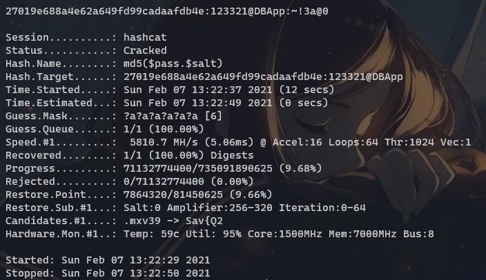
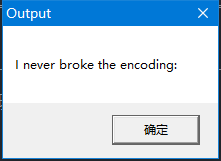

## Week 5, 01/31 - 02/06, BUUCTF

### reverse1

用 ExeinfoPE 看一下, 是一个 x64 程序.


IDA, 入口是`sub_140012170`, 一路跟踪下去到`sub_140012190`,  ~~然后分析不能~~

从 Strings window 看一下, 发现一条明显的提示语 `wrong flag`, 看一下, 是`sub_1400118C0`引用了它, 跳过去康康.


第18行的 `for`循环中, 把 `Str2[]`中的`o`全部替换为了`0`, 然后和输入的`Str1`进行比较, 判断是否正确.

`Str2[]`的内容是`{hello_world}`, 替换后输入程序检查, 确定正确.

`flag{hell0_w0rld}`

### reverse3

IDA, 找到 `main`之后 F5, 大概修改一些名称之后得到如下.

```c
int __cdecl main_0(int argc, const char **argv, const char **envp)
{
  size_t StrLen; // eax
  const char *v4; // eax
  size_t destLen2; // eax
  char v7; // [esp+0h] [ebp-188h]
  char v8; // [esp+0h] [ebp-188h]
  signed int j; // [esp+DCh] [ebp-ACh]
  int i; // [esp+E8h] [ebp-A0h]
  signed int destLen; // [esp+E8h] [ebp-A0h]
  char Destination[108]; // [esp+F4h] [ebp-94h] BYREF
  char Str[28]; // [esp+160h] [ebp-28h] BYREF
  char v14[8]; // [esp+17Ch] [ebp-Ch] BYREF

  for ( i = 0; i < 100; ++i )
  {
    if ( (unsigned int)i >= 0x64 )
      j____report_rangecheckfailure();
    Destination[i] = 0;
  }
  alert("please enter the flag:", v7);
  input("%20s", (char)Str);
  StrLen = j_strlen(Str);
  v4 = (const char *)sub_4110BE(Str, StrLen, v14);
  strncpy(Destination, v4, 0x28u);
  destLen = j_strlen(Destination);
  for ( j = 0; j < destLen; ++j )
    Destination[j] += j;
  destLen2 = j_strlen(Destination);
  if ( !strncmp(Destination, aE3nifih9bCNDh, destLen2) )
    alert("rigth flag!\n", v8);
  else
    alert("wrong flag!\n", v8);
  return 0;
}
```

在得到输入之后, `sub_4110BE`对输入的 `Str`进行了一些处理, 同时 27 行的 `for` 循环也对 `Destination[]` 进行了移位, 之后两者比较判断是否正确.

观察 `sub_4110BE`, 发现其中调用了一个 base64 的编码表, 结合行为确定是对输入进行 base64 编码.

把 `Destination[]`的内容进行反移位, 得到`e2lfbDB2ZV95b3V9`, base64 解码后得到 `{i_l0ve_you}`

`flag{i_l0ve_you}`

~~另外题中的"right"打错了...~~

### SimpleRev

DIE 检查, 发现是一个 x64 ELF 文件. IDA 打开, 定位到 `main`.

```C
int __cdecl __noreturn main(int argc, const char **argv, const char **envp)
{
  int v3; // eax
  char v4; // [rsp+Fh] [rbp-1h]

  while ( 1 )
  {
    while ( 1 )
    {
      printf("Welcome to CTF game!\nPlease input d/D to start or input q/Q to quit this program: ");
      v4 = getchar();
      if ( v4 != 'd' && v4 != 'D' )
        break;
      Decry();
    }
    if ( v4 == 'q' || v4 == 'Q' )
      Exit("Welcome to CTF game!\nPlease input d/D to start or input q/Q to quit this program: ", argv);
    puts("Input fault format!");
    v3 = getchar();
    putchar(v3);
  }
}
```

明显, 在 `Decry` 函数中进行了 flag 的验证....

```C
unsigned __int64 Decry()
{
  char currChar; // [rsp+Fh] [rbp-51h]
  int v2; // [rsp+10h] [rbp-50h]
  int v3; // [rsp+14h] [rbp-4Ch]
  int i; // [rsp+18h] [rbp-48h]
  int keyLen; // [rsp+1Ch] [rbp-44h]
  char src[8]; // [rsp+20h] [rbp-40h] BYREF
  __int64 v7; // [rsp+28h] [rbp-38h]
  int v8; // [rsp+30h] [rbp-30h]
  char *v9; // [rsp+40h] [rbp-20h] BYREF
  __int64 v10; // [rsp+48h] [rbp-18h]
  int v11; // [rsp+50h] [rbp-10h]
  unsigned __int64 v12; // [rsp+58h] [rbp-8h]

  v12 = __readfsqword(0x28u);
  *(_QWORD *)src = 'SLCDN';
  v7 = 0LL;
  v8 = 0;
  v9 = (char *)'wodah';
  v10 = 0LL;
  v11 = 0;
  text = join(key3, (const char *)&v9);         // text == killshadow
  strcpy(key, key1);                            // key == ASDFK
  strcat(key, src);                             // key == ASDFKNDCLS
  v2 = 0;
  v3 = 0;
  getchar();
  keyLen = strlen(key);
  for ( i = 0; i < keyLen; ++i )
  {
    if ( key[v3 % keyLen] > '@' && key[v3 % keyLen] <= 'Z' )
      key[i] = key[v3 % keyLen] + 32;
    ++v3;
  }
  printf("Please input your flag:");
  while ( 1 )
  {
    currChar = getchar();
    if ( currChar == '\n' )
      break;
    if ( currChar == ' ' )
    {
      ++v2;
    }
    else
    {
      if ( currChar <= 96 || currChar > 122 )   // NOT lower case
      {
        if ( currChar > '@' && currChar <= 'Z' )// upper case
        {
          str2[v2] = (currChar - 39 - key[v3 % keyLen] + 97) % 26 + 97;
          ++v3;
        }
      }
      else
      {
        str2[v2] = (currChar - 39 - key[v3 % keyLen] + 97) % 26 + 97;
        ++v3;
      }
      if ( !(v3 % keyLen) )
        putchar(' ');
      ++v2;
    }
  }
  if ( !strcmp(text, str2) )
    puts("Congratulation!\n");
  else
    puts("Try again!\n");
  return __readfsqword(0x28u) ^ v12;
}
```

在 37 行的 `while` 循环后, 通过计算 `str2[]`的值并判断是否与`text`相等来确定 flag 正确与否, 写个脚本爆破即可.

```python
upperTable='ABCDEFGHIJKLMNOPQRSTUVWXYZ'
lowerTable = upperTable.lower()
key=list('ADSFKNDCLS'.lower())
klens=len(key)

text='killshadow'
flag=''
flag2=''
for i in range(len(text)):
    str2=text[i]
    for c in upperTable:
        if str2== chr((ord(c) - 39 - ord(key[i  % klens]) + 97) % 26 + 97):
            flag+=c

for i in range(len(text)):
    str2=text[i]
    for c in lowerTable:
        if str2== chr((ord(c) - 39 - ord(key[i  % klens]) + 97) % 26 + 97):
            flag2+=c
print('flag{'+flag+'}')
print('flag{'+flag2+'}')
```

因为并未对大小写进行限定, 所以大小写理论上均可...大概, 总之大写是可以的.

`flag{KLDQCUDFZO}`

## Week 6, 02/07 - 02/14, BUUCTF

### CrackRTF

看题目说明, 在文件中藏了一个 rtf 文件, 不过用 binwalk 扫描没发现什么. 可能是加密了...

用 IDA 打开, 定位到 `main_0`, 发现需要两个密码, 长度均为 6 个字符, 其中第一个为纯数字, 与 `@DBApp` 链接后计算一个哈希值, 与 `6E32D0943418C2C33385BC35A1470250DD8923A9` 比较.

```C
int __cdecl main_0(int argc, const char **argv, const char **envp)
{
  DWORD v3; // eax
  DWORD v4; // eax
  char Str[260]; // [esp+4Ch] [ebp-310h] BYREF
  int v7; // [esp+150h] [ebp-20Ch]
  char String1[260]; // [esp+154h] [ebp-208h] BYREF
  char Destination[260]; // [esp+258h] [ebp-104h] BYREF

  memset(Destination, 0, sizeof(Destination));
  memset(String1, 0, sizeof(String1));
  v7 = 0;
  printf("pls input the first passwd(1): ");
  scanf("%s", Destination);
  if ( strlen(Destination) != 6 )
  {
    printf("Must be 6 characters!\n");
    ExitProcess(0);
  }
  v7 = atoi(Destination);
  if ( v7 < 100000 )
    ExitProcess(0);
  strcat(Destination, "@DBApp");
  v3 = strlen(Destination);
  getSHA1((BYTE *)Destination, v3, String1);
  if ( !_strcmpi(String1, "6E32D0943418C2C33385BC35A1470250DD8923A9") )
  {
    printf("continue...\n\n");                  // Destination == 123321@DBApp
    printf("pls input the first passwd(2): ");
    memset(Str, 0, sizeof(Str));
    scanf("%s", Str);
    if ( strlen(Str) != 6 )
    {
      printf("Must be 6 characters!\n");
      ExitProcess(0);
    }
    strcat(Str, Destination);
    memset(String1, 0, sizeof(String1));
    v4 = strlen(Str);
    getMD5((BYTE *)Str, v4, String1);
    if ( !_strcmpi("27019e688a4e62a649fd99cadaafdb4e", String1) )
    {
      if ( !(unsigned __int8)sub_40100F(Str) )
      {
        printf("Error!!\n");
        ExitProcess(0);
      }
      printf("bye ~~\n");
    }
  }
  return 0;
}
```


进入 `sub_401230`, 定位到 `CryptCreateHash(phProv, 0x8004u, 0, 0, &phHash)`, 搜一下这个函数的[文档](https://docs.microsoft.com/en-us/windows/win32/seccrypto/alg-id), 发现第二个参数控制了计算的哈希种类, `0x8004`是 SHA1, `0x8003`是 MD5. 由此我们可以对在 [100000, 1000000) 的前半部分进行爆破, 写个脚本.

```python
import hashlib

prefix = ""
postfix = "@DBApp"

for i in range(100000, 1000000):
    prefix = str(i)
    shaObj = hashlib.sha1(bytes(prefix + postfix, encoding="UTF-8"))
    # print(shaObj.hexdigest())
    if(shaObj.hexdigest() == "6E32D0943418C2C33385BC35A1470250DD8923A9".lower()):
        print(prefix + postfix)
     
```

这样, 我们得到了第一个密码 `1233321`, 这时 `Destination == "123321@DBApp"`, 输入的第二个密码后面会连接 `Destination`, 然后计算 MD5 值, 和 `27019e688a4e62a649fd99cadaafdb4e`比较, 判断是否正确.

需要注意的是, 第二个密码只限制了长度, 没有限制是纯数字...~~没注意到的话你可能就会和我一样卡住了~~

到这里, 我们有两种方法.

#### 充分利用你电脑的计算能力

我们已知第二个 MD5 原文的后半部分和前半部分的长度, 相当于一个加盐的 MD5 爆破 - [HashCat ](https://github.com/hashcat/hashcat)很适合干这个事儿, 特别是你的 GPU 比较强的时候.

用如下的命令行进行一次 `md5($pass.$salt)`掩码攻击. ~~其实就是暴力穷举, 不过更高级一点, 大概~~

`.\hashcat.exe -m 10  "27019e688a4e62a649fd99cadaafdb4e:123321@DBApp" -a 3 ?a?a?a?a?a?a`

在我的电脑上, 大概十秒就得到了结果...



前半部分是 `~!3a@0`, 把俩密码输入程序, 得到一个 RTF 文档, 打开就是 flag.

~~不过, 我认为这应该不是出题人的最初想法吧~~


#### 充分利用你自己的 ~~计算能力~~ 解题能力

在 `main_0` 的 44 行, 我们发现在两个密码验证正确后, 调用了 `sub_40400F`, 参数是 `Str`. 

`sub_40400F`会再调用 `sub_4014D0`, 参数变为 `LPCSTR`类型.

```c
char __cdecl sub_4014D0(LPCSTR lpString)
{
  LPCVOID lpBuffer; // [esp+50h] [ebp-1Ch]
  DWORD NumberOfBytesWritten; // [esp+58h] [ebp-14h] BYREF
  DWORD nNumberOfBytesToWrite; // [esp+5Ch] [ebp-10h]
  HGLOBAL hResData; // [esp+60h] [ebp-Ch]
  HRSRC hResInfo; // [esp+64h] [ebp-8h]
  HANDLE hFile; // [esp+68h] [ebp-4h]

  hFile = 0;
  hResData = 0;
  nNumberOfBytesToWrite = 0;
  NumberOfBytesWritten = 0;
  hResInfo = FindResourceA(0, (LPCSTR)0x65, "AAA");
  if ( !hResInfo )
    return 0;
  nNumberOfBytesToWrite = SizeofResource(0, hResInfo);
  hResData = LoadResource(0, hResInfo);
  if ( !hResData )
    return 0;
  lpBuffer = LockResource(hResData);
  sub_401005(lpString, (int)lpBuffer, nNumberOfBytesToWrite);
  hFile = CreateFileA("dbapp.rtf", 0x10000000u, 0, 0, 2u, 0x80u, 0);
  if ( hFile == (HANDLE)-1 )
    return 0;
  if ( !WriteFile(hFile, lpBuffer, nNumberOfBytesToWrite, &NumberOfBytesWritten, 0) )
    return 0;
  CloseHandle(hFile);
  return 1;
}
```

首先是 `FindResourceA`这个函数, 从[文档](https://docs.microsoft.com/en-us/windows/win32/api/winbase/nf-winbase-findresourcea)来看, 它会尝试寻找名称为 `0x65`, 类型为 `AAA` 的资源, 然后通过`SizeofResource`计算长度, 通过`LoadResource`加载到`lpBuffer`中并上锁, 之后调用了`sub_401005`进行了什么操作, 然后创建`dbapp.rtf`并写文件, 最后关闭.

看来`sub_401005`就是解密函数了.

`sub_401005`会继续调用`sub_401420`, 主要是一个异或的循环...

```C
unsigned int __cdecl sub_401420(LPCSTR key, int fileContentOffset, int a3)
{
  unsigned int result; // eax
  unsigned int i; // [esp+4Ch] [ebp-Ch]
  unsigned int keyLen; // [esp+54h] [ebp-4h]

  keyLen = lstrlenA(key);
  for ( i = 0; ; ++i )
  {
    result = i;
    if ( i >= a3 )
      break;
    *(_BYTE *)(i + fileContentOffset) ^= key[i % keyLen];
  }
  return result;
}
```

在这里, 会将现有数据的每一位和密钥进行异或作为解密, 而原文件是一个 RTF 格式的文件, 文件头是 [`7B 5C 72 74 66 31`](https://www.filesignatures.net/index.php?page=search&search=7B5C72746631&mode=SIG), 正好六个字节, 和第二段密码一样长.

参考[这篇题解](https://blog.csdn.net/qq_43786458/article/details/102488408), 用 ResourceHacker 看一下资源,果然找到了这个. (0x65 == 101)


加密后的文件头是 `05 7D 41 15 26 01 `, 把它和原来的文件头进行异或就得到了第二段密码: `~!3a@0`

`flag{N0_M0re_Free_Bugs}`


## Week 11, 03/14 - 03/20, BUUCTF

### [SUCTF2019]SignIn

~~好像摸鱼摸的太狠了... 从开学到现在啥也没干...~~

IDA 打开, 定位到`main`, 发现两个大整数.

```c
__int64 __fastcall main(int a1, char **a2, char **a3)
{
  char v4[16]; // [rsp+0h] [rbp-4A0h] BYREF
  char v5[16]; // [rsp+10h] [rbp-490h] BYREF
  char v6[16]; // [rsp+20h] [rbp-480h] BYREF
  char v7[16]; // [rsp+30h] [rbp-470h] BYREF
  char input[112]; // [rsp+40h] [rbp-460h] BYREF
  char coded[1000]; // [rsp+B0h] [rbp-3F0h] BYREF
  unsigned __int64 v10; // [rsp+498h] [rbp-8h]

  v10 = __readfsqword(0x28u);
  puts("[sign in]");
  printf("[input your flag]: ");
  __isoc99_scanf("%99s", input);
  sub_96A(input, coded);
  __gmpz_init_set_str(v7, "ad939ff59f6e70bcbfad406f2494993757eee98b91bc244184a377520d06fc35", 16LL);
  __gmpz_init_set_str(v6, coded, 16LL);
  __gmpz_init_set_str(v4, "103461035900816914121390101299049044413950405173712170434161686539878160984549", 10LL);
  __gmpz_init_set_str(v5, "65537", 10LL);
  __gmpz_powm(v6, v6, v5, v4);
  if ( (unsigned int)__gmpz_cmp(v6, v7) )
    puts("GG!");
  else
    puts("TTTTTTTTTTql!");
  return 0LL;
}
```

`sub_96A`会把输入进行处理, 得到 16 进制字符串. 之后的`__gmpz_`系列函数是 GNU 的高精度计算库.

16 ~ 19 行初始化了四个整数, 查看[文档](https://gmplib.org/manual/Integer-Exponentiation)发现`__gmpz_powm(mpz_t rop, const mpz_t base, const mpz_t exp, const mpz_t mod)`实际上等价于`rop = (base ^ exp) % mod`. 另外, 据说这个函数经常在 RSA 算法中出现...

RSA! 这些大整数正好就是 RSA 中会用到的! 对应一下, `v7`是密文, `v6`是明文, `v5`是`e`, `v4`就是`n`. 把`v4`放到 [factor.db](http://factordb.com/index.php) 分解一下, 得到了`p`和`q`.


这样, RSA 算法的所有变量我们都拿到了, 直接写个脚本解密就能拿到 flag 了.

```python
import gmpy2
import binascii

n = 103461035900816914121390101299049044413950405173712170434161686539878160984549

p = gmpy2.mpz(282164587459512124844245113950593348271)
q = gmpy2.mpz(366669102002966856876605669837014229419)
e = gmpy2.mpz(65537)
eula = (p-1)*(q-1)
d = gmpy2.invert(e, eula)
c = gmpy2.mpz(0xad939ff59f6e70bcbfad406f2494993757eee98b91bc244184a377520d06fc35)

dec = gmpy2.powmod(c, d, n)
print("十进制:\n%s"%dec)
dec_hex = hex(dec)[2:]
print("十六进制:\n%s"%(dec_hex,))
print("ascii:\n%s"%(binascii.a2b_hex(dec_hex).decode(encoding="utf8")))
```

由于`gmpy2`在我的 Windows 下装不上 (需要`gmp` `mpfr ` `mpc`), 因此我在 Ubuntu 虚拟机下面装了.

拿到结果.


flag: `suctf{Pwn_@_hundred_years}`

## Week 13, 03/28 - 04/03, BUUCTF

### [FlareOn6] Overlong

PE32 程序, 没发现有壳, 直接用 IDA 打开, 只有三个函数, 而且没有 `.init_array`和`.fini_array`段, 没有发现有价值的明文字符串 - 也就是说有某种形式的加解密.


运行一下试试, 注意到下图最后是个冒号.... 推测应该是长度限制了.



IDA 打开`start`函数, 很容易定位到解密函数, 它的第二个参数是密文, 第三个参数就是长度.

```c
int __stdcall start(int a1, int a2, int a3, int a4)
{
  CHAR Text[128]; // [esp+0h] [ebp-84h] BYREF
  int v6; // [esp+80h] [ebp-4h]

  v6 = sub_401160(Text, &unk_402008, 28);       // 解密函数
  Text[v6] = 0;
  MessageBoxA(0, Text, Caption, 0);
  return 0;
}
```

```assembly
.text:004011C0 start           proc near
.text:004011C0
.text:004011C0 Text            = byte ptr -84h
.text:004011C0 var_4           = dword ptr -4
.text:004011C0
.text:004011C0                 push    ebp
.text:004011C1                 mov     ebp, esp
.text:004011C3                 sub     esp, 84h
.text:004011C9                 push    1Ch
.text:004011CB                 push    offset unk_402008
.text:004011D0                 lea     eax, [ebp+Text]
.text:004011D6                 push    eax
.text:004011D7                 call    sub_401160
.text:004011DC                 add     esp, 0Ch
.text:004011DF                 mov     [ebp+var_4], eax
.text:004011E2                 mov     ecx, [ebp+var_4]
.text:004011E5                 mov     [ebp+ecx+Text], 0
.text:004011ED                 push    0               ; uType
.text:004011EF                 push    offset Caption  ; "Output"
.text:004011F4                 lea     edx, [ebp+Text]
.text:004011FA                 push    edx             ; lpText
.text:004011FB                 push    0               ; hWnd
.text:004011FD                 call    ds:MessageBoxA
.text:00401203                 xor     eax, eax
.text:00401205                 mov     esp, ebp
.text:00401207                 pop     ebp
.text:00401208                 retn    10h
.text:00401208 start           endp
```


`unk_402008`的长度是 `0xAF`, 尝试修改一下. **但是由于某些原因, 在用 KeyPatch 修改`push 1Ch`的时候会干扰下一条指令...**

用动态调试, 在`0x4011C9`下个断点, 在 push 之后直接把栈上数据改成 `0xAF`, 如下图.


然后继续执行, 看到了 ~~好康的~~ 答案.


`flag{I_a_M_t_h_e_e_n_C_o_D_i_n_g@flare-on.com}`

### [GXYCTF2019] simple CPP

~~果然题面里有 simple 的不是送分题就是送命题~~

IDA打开, 按顺序把`main`分成三部分

#### 第一部分 异或加密

```c
  v3 = 0;
  v40 = 0i64;
  v41 = 15i64;
  LOBYTE(Block[0]) = 0;
  v4 = std::operator<<<std::char_traits<char>>(
         std::cout,
         (__int64)"I'm a first timer of Logic algebra , how about you?");
  std::ostream::operator<<(v4, std::endl<char,std::char_traits<char>>);
  std::operator<<<std::char_traits<char>>(std::cout, (__int64)"Let's start our game,Please input your flag:");
  std::operator>><char>(std::cin, (std::string *)Block);
  std::ostream::operator<<(std::cout, std::endl<char,std::char_traits<char>>);
  if ( v40 - 5 > 25 ) //v40 is len of input str
  {
    v35 = std::operator<<<std::char_traits<char>>(std::cout, (__int64)"Wrong input ,no GXY{} in input words");
    std::ostream::operator<<(v35, std::endl<char,std::char_traits<char>>);
    goto LABEL_41;
  }
  v5 = (unsigned __int8 *)operator new(0x20ui64);
  v6 = v5;
  if ( v5 )
  {
    *(_QWORD *)v5 = 0i64;
    *((_QWORD *)v5 + 1) = 0i64;
    *((_QWORD *)v5 + 2) = 0i64;
    *((_QWORD *)v5 + 3) = 0i64;
  }
  else
  {
    v6 = 0i64;
  }
  v7 = 0;
  if ( v40 )
  {
    v8 = 0i64;
    do
    {
      v9 = Block;
      if ( v41 >= 0x10 )
        v9 = (void **)Block[0];
      v10 = &qword_7FF73C476048;
      if ( (unsigned __int64)qword_7FF73C476060 >= 0x10 )// qword -> xor key
        v10 = (void **)qword_7FF73C476048;
      v6[v8] = *((_BYTE *)v9 + v8) ^ *((_BYTE *)v10 + v7 % 27);
      ++v7;
      ++v8;
    }
    while ( v7 < v40 );
  }
```

这里会首先对输入进行一次异或加密并保存在`v6`, key 是 `*qword_7FF73C476060`, 实际内容未知, 等到动态调试时再确定.

#### 第二部分 分组

```c
  v11 = 0i64;
  v12 = 0i64;
  v13 = 0i64;
  v14 = 0i64;
  if ( (int)v40 > 30 )
    goto LABEL_27;
  v15 = 0;
  if ( (int)v40 <= 0 )
    goto LABEL_27;
  v16 = v6; //v16 points to input str
  do
  {
    v17 = *v16 + v11;
    ++v15;
    ++v16;
    switch ( v15 )
    {
      case 8:
        v14 = v17;
        goto LABEL_23;
      case 16:
        v13 = v17;
        goto LABEL_23;
      case 24:
        v12 = v17;
LABEL_23:
        v17 = 0i64;
        break;
      case 32:
        std::operator<<<std::char_traits<char>>(std::cout, (__int64)"ERRO,out of range");
        exit(1);
    }
    v11 = v17 << 8;
  }
  while ( v15 < (int)v40 );
```

在这里把输入按照 8 个字符为一组 (正好 64 位)分开, 分别赋给`v14` `v13` `v12` `v11`.

#### 第三部分 校验

```c
  if ( v14 )
  {
    v18 = (__int64 *)operator new(0x20ui64);
    *v18 = v14;
    v18[1] = v13;
    v18[2] = v12;
    v18[3] = v11;
    goto LABEL_28;
  }
LABEL_27:
  v18 = 0i64;
LABEL_28:
  v38 = v18[2]; //v12
  v19 = v18[1]; //v13
  v20 = *v18; //v14
  v21 = (__int64 *)operator new(0x20ui64);
  v22 = v19 & v20; //v13&v14
  *v21 = v19 & v20;
  v23 = v38 & ~v20; 
  v21[1] = v23;
  v24 = ~v19;
  v25 = v38 & v24;
  v21[2] = v38 & v24;
  v26 = v20 & v24;
  v21[3] = v26;
  if ( v23 != 0x11204161012i64 )
  {
    v21[1] = 0i64;
    v23 = 0i64;
  }
  v27 = v23 | v22 | v25 | v26;
  v28 = v18[1];
  v29 = v18[2];
  v30 = v25 & *v18 | v29 & (v22 | v28 & ~*v18 | ~(v28 | *v18));
  v31 = 0;
  if ( v30 == 0x8020717153E3013i64 )
    v31 = v27 == 0x3E3A4717373E7F1Fi64;
  if ( (v27 ^ v18[3]) == 0x3E3A4717050F791Fi64 )
    v3 = v31;
  if ( (v23 | v22 | v28 & v29) == (~*v18 & v29 | 0xC00020130082C0Ci64) && v3 )
  {
    v32 = std::operator<<<std::char_traits<char>>(std::cout, (__int64)"Congratulations!flag is GXY{");
	//...... other things ......
  }
```

所以我们可以得到如下的方程组...

```c
z & ~x == 1176889593874
z & ~x | y & x | z & ~y | x & ~y == 4483974544037412639
z & ~y &x | z &(y & x | y & ~x | ~(y | x)) == 577031497978884115
(z & ~x | y & x | z & ~y | x & ~y) ^ w == 4483974543195470111
```

用 z3 解之, 得到

```c
w = 842073600
y = 290580315766788
x = 4483973367147818765
z = 577031497978884115
```

`v6`就是`x y z w`按顺序连接得到的加密后的 flag.

#### 最后一击

接下来我们在`0x13DF`的位置下个断点, 观察一下`qword_7FF73C476048`指向的内容.

```assembly
.data:00007FF73C476048 qword_7FF73C476048 dq 1D5FD108F30h      ; DATA XREF: main+DF↑o
```

选中`0x1D5FD108F30h`处的数据, Edit - Strings, 得到`i_will_check_is_debug_or_not`

```python
enc =[0x3e,0x3a,0x46,0x05,0x33,0x28,0x6f,0x0d,0x1,0x08,0x48,0x00,0x00,0x80,0x00,0x04,0x8,0x02,0x07,0x17,0x15,0x3e,0x30,0x13,0x32,0x31,0x06,0x00]
key = "i_will_check_is_debug_or_not"
flag = ""

for i in range(len(enc)-1):
	flag += chr((ord(key[i%27])) ^ enc[i])
print(flag)
```

用`y`手动修正一下, 得到 flag.

`flag{We1l_D0ne!P0or_algebra_am_i}`


