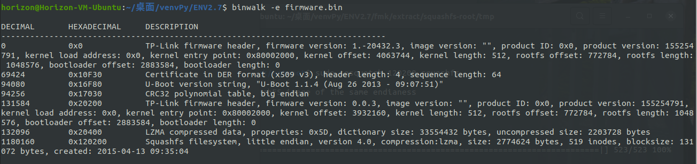

# 2021 Week 2 - 01/26


## 0x00 DDCTF-Android Easy

~~接触到的第二道安卓逆向题~~

下载, 发现是个 zip , 但是有 apk 的目录结构, 用 jadx-gui 打开可以看到如下的结构


很明显, 重点在 FlagActivity 类里面, `i()`中将`p` `q` 两个byte数组进行一系列操作后得到解密后的`byte[] bArr2`, 作为`String()`的参数返回.  之后在`onClickTest()`中通过将输入的字符串同`i()`的返回值进行比较, 判定 flag 是否正确.

那就很显然, `i()`的返回值就是正确的 flag. 把`i()`运行一次, 得到返回值`DDCTF-3ad60811d87c4a2dba0ef651b2d93476@didichuxing.com`, 用`flag{ }`包裹提交.

`flag{DDCTF-3ad60811d87c4a2dba0ef651b2d93476@didichuxing.com}`


## 0x01 WELCOME TO JNI

> "JNI是什么？"

> **JNI** （**Java Native Interface，Java本地接口**）是一种[编程框架](https://zh.wikipedia.org/w/index.php?title=编程框架&action=edit&redlink=1)，使得[Java虚拟机](https://zh.wikipedia.org/wiki/Java虚拟机)中的[Java](https://zh.wikipedia.org/wiki/Java)程序可以调用本地应用/或库，也可以被其他程序调用。 本地程序一般是用其它语言（[C](https://zh.wikipedia.org/wiki/C语言)、[C++](https://zh.wikipedia.org/wiki/C%2B%2B)或[汇编语言](https://zh.wikipedia.org/wiki/汇编语言)等）编写的，并且被编译为基于本机硬件和操作系统的程序。
>
>
> 
> -- Wikipedia

简单的来说, JNI 可以让 Java 调用其他语言的库.

用 jadx-gui 打开 apk 文件, 定位到 Main Activity --在`com.reverier.xdsec_re_20200126`下面


在`MainActivity`类中, 可以看到声明了一个 native 方法 - `loginUtils()`, 从名字推测是 ~~检查 flag~~ 登陆验证, 加载了一个本地库`native-lib`, 它对应的文件在`/lib`下面, 对应不同的架构.

在 33 行可以看到, `loginUtil()`接受了输入的字符串作为参数, 然后返回一个布尔值作为结果, 控制输出`Right`和`Wrong` - 这就是重点了.

从 apk 中提取出 x86 架构对应的`native-lib.so`, IDA 打开, 找到对应的方法`Java_com_reverier_xdsec_1re_120200126_MainActivity_loginUtils()`, 反编译如下.


第 8 行开始, `v6`保存了作为参数的字符串的长度, `v5`则保存了另一个字符串的长度, `v4`保存了参数字符串. 第 11 行比较两个字符串的长度, 若相等则再通过`strncmp()`比较. 

综上, `off_1FD4 + 5972`应该就指向了flag. `0x1FD4 + 5972d == 0x880`, 跳转过去, 发现果然保存着flag.


`flag{welcome_to_naive_lib!}`

做完了才意识到, 其实当时直接从 IDA 的 Strings window 能直接看到这个明文字符串...


## 0×02 Codegate CTF 2018 RedVelvet

IDA 打开, 跳转到`main()`, 发现了一大串`funcX()`的调用.  ~~有点壮观(x~~

观察结构发现, 在 48 行, ``fgets()`接受了 28 个字节的输入(包含末尾的`\n`), 保存到`s`中. 而`funcX()`并未改变`s`的值, 而是进行了一些验证, 比如`func7()`: 


这 15 个`funcX()`共同对`s`进行了一系列的检查, 然后计算`s`的 SHA256 值, 并和`0a435f46288bb5a764d13fca6c901d3750cee73fd7689ce79ef6dc0ff8f380e5`比较, 确定 flag 正确与否.

~~所以直接用 hashcat 穷举破解理论上倒也可行~~

接下来就是 angr 发挥威力的时候了, 我们不需要将程序执行完, 只需要找到一个输入, 能够满足这十五个`funcX()`的约束, 使程序运行到`SHA256_Init()`前即可 - 对应的地址是`0x401534`.

同时, 我们还需要避免进入`funcX()`中的`exit(1)`的分支, 以`func1()`为例.


`0x4009ED`和`0x4009F7`就是我们不希望运行到的地方, 因为到这里说明我们的输入没有通过`func1()`的检验, 执行了`exit(1)` - 其他的`funcX()`同理.

这样, 我们得到了期望执行到的地址与要避免的地址, 写出如下脚本.

```python
import angr

prog = angr.Project('./RedVelvet', load_options={'auto_load_libs': False})   
state = prog.factory.entry_state()    
simgr = prog.factory.simgr(state)   

simgr.explore(find=0x00401534 ,avoid=[0x4009ED,0x4009F7,0x400A3C,0x400A46,0x400A9F,0x400B01,0x400B5C,0x400C05,0x400CAB,0x400D51,0x400DD6,0x400E5E,0x400F07,0x400FAD,0x4105F,0x4010E9, 0x40119D]) 

flag = simgr.found[0].posix.dumps(0)
print(flag)


```

经过漫长的运行( VMWare Ubuntu + Docker angr/angr 大概 30 分钟? ), 我们得到了如下输出 (`fg`是因为我之前误以为写错了, 于是挂起去检查脚本了...)


放到源程序里检查一下, 看来没毛病. 


`flag{What_You_Wanna_Be?:)_la_la}`

### Something Else

1. RedVelvet依赖 1.0.0 版本的 libcrypto.so, 但是包含它的老版本的 openssl 已经过时了, 最后用`apt-file`查到英伟达的`nslight-system`还带这东西, 于是安装之后手动复制出来...
2. 理论上通过 15 个`funcX()`中的约束条件, 可以直接求出来满足的输入值, 就像`z3`那样
3. 如果限定输入长度与范围( ASCII 可见字符) 的话, 应当能够跑的更快, 学习中
4. 关于原题: 暂时没找到....

# 2021 Week 3 - 02/10

## 0x00 PyDis

一道 Python 逆向题, 本来想直接用 uncompyle6 来着, 不过它目前只能支持到 3.8 ...

不过我们总是可以自己手动来解决 √ ~~从零开始, 半天过去了~~

根据提示, 用 `marshal` 解析 pyc 文件, 提取出指令部分, 然后用 `dis` 反编译, 拿到字节码指令. 根据 [Python文档](https://docs.python.org/3/library/dis.html), 我们可以写出同义的代码, 如下. 

(`#`开头的是我们推测出的每行对应的源代码, 缩进一致)

```python
  1           0 BUILD_LIST               0
              2 LOAD_CONST               0 ((178, 184, 185, 191, 182, 165, 174, 191, 129, 183, 187, 176, 129, 169, 191, 167, 163))
              4 CALL_FINALLY             1 (to 7)
              6 STORE_NAME               0 (magic)

    # magic = [178, ....]

  2           8 LOAD_NAME                1 (input)
             10 LOAD_CONST               1 ('flag >>> ')
             12 CALL_FUNCTION            1
             14 STORE_NAME               2 (inp)

    # inp = input("flag >>> ")

  4          16 LOAD_NAME                3 (list)
             18 LOAD_NAME                2 (inp)
             20 CALL_FUNCTION            1
             22 STORE_NAME               4 (flag)

    # inp = list(flag)

  5          24 LOAD_NAME                5 (len)
             26 LOAD_NAME                4 (flag)
             28 CALL_FUNCTION            1
             30 LOAD_NAME                5 (len)
             32 LOAD_NAME                0 (magic)
             34 CALL_FUNCTION            1
             36 COMPARE_OP               3 (!=)
             38 POP_JUMP_IF_FALSE       54

    # if(len(flag) != len(magic)):

  6          40 LOAD_NAME                6 (print)
             42 LOAD_CONST               2 ('qwq')
             44 CALL_FUNCTION            1
             46 POP_TOP

    #   print("qwq")

  7          48 LOAD_NAME                7 (exit)
             50 CALL_FUNCTION            0
             52 POP_TOP
    
    #   exit()

  9     >>   54 LOAD_NAME                8 (range)
             56 LOAD_NAME                5 (len)
             58 LOAD_NAME                4 (flag)
             60 CALL_FUNCTION            1
             62 LOAD_CONST               3 (2)
             64 BINARY_FLOOR_DIVIDE
             66 CALL_FUNCTION            1
             68 GET_ITER
        >>   70 FOR_ITER                54 (to 126)
             72 STORE_NAME               9 (i)
    
    # for i in range(len(flag) // 2):

 10          74 LOAD_NAME                4 (flag)
             76 LOAD_CONST               3 (2)
             78 LOAD_NAME                9 (i)
             80 BINARY_MULTIPLY
             82 LOAD_CONST               4 (1)
             84 BINARY_ADD
             86 BINARY_SUBSCR
             88 LOAD_NAME                4 (flag)
             90 LOAD_CONST               3 (2)
             92 LOAD_NAME                9 (i)
             94 BINARY_MULTIPLY
             96 BINARY_SUBSCR
             98 ROT_TWO
            100 LOAD_NAME                4 (flag)
            102 LOAD_CONST               3 (2)
            104 LOAD_NAME                9 (i)
            106 BINARY_MULTIPLY
            108 STORE_SUBSCR                           # flag[2*i] = flag[2*i+1] 
            110 LOAD_NAME                4 (flag)
            112 LOAD_CONST               3 (2)
            114 LOAD_NAME                9 (i)         # flag[2*i+1] = flag[2*i]
            116 BINARY_MULTIPLY
            118 LOAD_CONST               4 (1)
            120 BINARY_ADD
            122 STORE_SUBSCR
            124 JUMP_ABSOLUTE           70

    #   flag[2*i], flag[2*i+1] = flag[2*i+1], flag[2*i]

 12     >>  126 BUILD_LIST               0
            128 STORE_NAME              10 (check)

    # check = []

 14         130 LOAD_NAME                8 (range)
            132 LOAD_NAME                5 (len)
            134 LOAD_NAME                4 (flag)
            136 CALL_FUNCTION            1
            138 CALL_FUNCTION            1
            140 GET_ITER
        >>  142 FOR_ITER                26 (to 170)
            144 STORE_NAME               9 (i)

    # for i in range(len(flag)):

 15         146 LOAD_NAME               10 (check)
            148 LOAD_METHOD             11 (append)
            150 LOAD_NAME               12 (ord)
            152 LOAD_NAME                4 (flag)
            154 LOAD_NAME                9 (i)
            156 BINARY_SUBSCR
            158 CALL_FUNCTION            1
            160 LOAD_CONST               5 (222)
            162 BINARY_XOR
            164 CALL_METHOD              1
            166 POP_TOP
            168 JUMP_ABSOLUTE          142

    #   check.append(ord(flag[i]) ^ 222)

 17     >>  170 LOAD_NAME                8 (range)
            172 LOAD_NAME                5 (len)
            174 LOAD_NAME                0 (magic)
            176 CALL_FUNCTION            1
            178 CALL_FUNCTION            1
            180 GET_ITER
        >>  182 FOR_ITER                34 (to 218)
            184 STORE_NAME               9 (i)

    # for i in range(len(magic)):

 18         186 LOAD_NAME               10 (check)
            188 LOAD_NAME                9 (i)
            190 BINARY_SUBSCR
            192 LOAD_NAME                0 (magic)
            194 LOAD_NAME                9 (i)
            196 BINARY_SUBSCR
            198 COMPARE_OP               3 (!=)
            200 POP_JUMP_IF_FALSE      182

    #   if(check[i] != magic[i]):

 19         202 LOAD_NAME                6 (print)
            204 LOAD_CONST               2 ('qwq')
            206 CALL_FUNCTION            1
            208 POP_TOP

    #       print("qwq")

 20         210 LOAD_NAME                7 (exit)
            212 CALL_FUNCTION            0
            214 POP_TOP
            216 JUMP_ABSOLUTE          182

    #       exit()

 22     >>  218 LOAD_NAME                6 (print)
            220 LOAD_CONST               6 ('happy new year!')
            222 CALL_FUNCTION            1
            224 POP_TOP
            226 LOAD_CONST               7 (None)
            228 RETURN_VALUE

    # print("happy new year!")


```

之后写个jio本解密就行了.

```python
enc = [178, 184, 185, 191, 182, 165, 174, 191,
       129, 183, 187, 176, 129, 169, 191, 167, 163]
dec = ""

for i in range(len(enc)):
    enc[i] = enc[i] ^ 222

for i in range(len(enc) // 2):
    dec += chr(enc[2*i+1])
    dec += chr(enc[2*i])

print(dec)
```

`flag{hapi_new_ya`, 记得补上 `}`


## 0x01 FlareOn4 IgniteMe

`die`查壳, 确认 32 位 pe 文件, 没壳, IDA 打开, 定位到入口点 `start`函数.

```c
void __noreturn start()
{
  DWORD NumberOfBytesWritten; // [esp+0h] [ebp-4h] BYREF

  NumberOfBytesWritten = 0;
  stdinHandle = GetStdHandle(4294967286u);      // stdin
  stdoutHandle = GetStdHandle(0xFFFFFFF5);      // stdout
  WriteFile(stdoutHandle, aG1v3M3T3hFl4g, 0x13u, &NumberOfBytesWritten, 0);
  praseInput();
  if ( sub_401050() )
    WriteFile(stdoutHandle, aG00dJ0b, 0xAu, &NumberOfBytesWritten, 0);
  else
    WriteFile(stdoutHandle, aN0tT00H0tRWe7r, 0x24u, &NumberOfBytesWritten, 0);
  ExitProcess(0);
}
```

`GetStdHandle`函数没见过, 查了一下[文档](https://docs.microsoft.com/zh-cn/windows/console/getstdhandle), 是获得设备句柄, 参数决定是标准 输入/输出/错误 设备.

在第 8 行输出提示之后调用了一个函数, 推测是解析输入 - 同时确定的输入缓冲区的第一个零字节的位置作为结尾. 然后在第 10 行调用`sub_401050`检验 flag, 

```c
int sub_401050()
{
  int v1; // [esp+0h] [ebp-Ch]
  int i; // [esp+4h] [ebp-8h]
  unsigned int j; // [esp+4h] [ebp-8h]
  char key; // [esp+Bh] [ebp-1h]

  v1 = getFirstZeroBytePos((int)prasedInput);
  key = sub_401000();                           // 0x4
  for ( i = v1 - 1; i >= 0; --i )
  {
    encIn[i] = key ^ prasedInput[i];
    key = prasedInput[i];
  }
  for ( j = 0; j < 39; ++j )
  {
    if ( encIn[j] != (unsigned __int8)enc[j] )
      return 0;
  }
  return 1;
}
```

是一个简单的循环异或加密, 不过注意是反向的, 初始的`key`是`0x4`. 写个jio本解密, 拿到 flag.

`flag{R_y0u_H0t_3n0ugH_t0_1gn1t3@flare-on.com}`

~~还真是晚上做的...~~

## 0x02 BUUCTF Firmware

看题目是一个路由器固件的分析, 用 binwalk 扫描一下, 得到了文件系统的位置, 也就是提取出来的`120200.squashfs`文件.



用 `file`命令确认了一下, 是 squashfs 文件系统, 不过不能直接用`mount`挂载 - 可能是因为有 lzma 压缩了....

在网上搜索了一下, 得知 [firmware-mod-kit](https://github.com/mirror/firmware-mod-kit) (简称 fmk) 可以从 squashfs 提取文件, 不过在我这里总是提取失败, 或者返回成功但是啥也没提取出来... 也许是因为 fmk 从 2013 年之后没更新过吧...

最后用 `unsquashfs` 提取成功 (是 [squashfs-tools](https://github.com/plougher/squashfs-tools) 下的一个工具), 在 `/tmp`下发现一个 `backdoor` 文件...~~还好这名字挺明显...~~

确认是 32 位的 ARM ELF 文件, die 检查发现 upx 壳, 脱壳之后 IDA 打开, 定位到 `main`.

在前面获取 MAC 等等之后, 这个 `initConnection`函数引起了我们的注意, 尤其是这里.

```c
 while ( 1 )
  {
    while ( initConnection() )
    {
      puts("Failed to connect...");
      sleep(5u);
    }
     
    // do some other things
     
   }
```

在`initConnextion`返回不为零时, 会等待五秒再重来 - 这里应该就是回连服务器了. 进去看看, 确定地址`echo.byethost51.com`, 端口`36667`.

`MD5(echo.byethost51.com:36667) == 33a422c45d551ac6e4756f59812a954b`

所以, `flag{33a422c45d551ac6e4756f59812a954b}`


## 最后, 祝大家新年快乐🍻